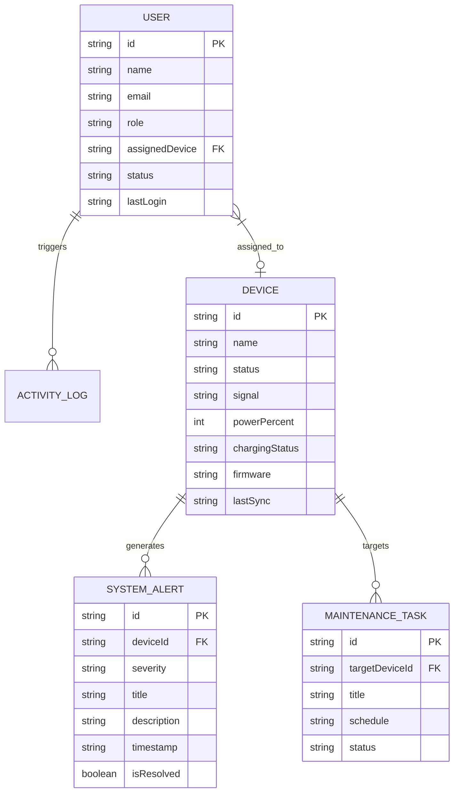
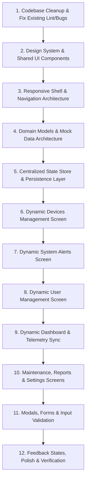

# Skylink Frontend In-Depth Technical Analysis & Audit

> **Document Version:** 1.0.0  
> **Target Application:** SkyLink Network Systems (Project: `networkscan`)  
> **Inspection Date:** September 2026  
> **Scope:** Pure Frontend Analysis (Architecture, Components, UI/UX, State, Responsiveness, Data Flow, Bugs, and Roadmap).  
> **Constraint Notice:** Zero source files were modified, refactored, or redesigned during this inspection. All credentials and tokens have been redacted.

---

## 1. Current Frontend Overview

### 1.1 What Skylink Currently Does
**SkyLink Network Systems** is an enterprise-grade network infrastructure monitoring and hardware operations dashboard. The product is intended to provide network engineers, site reliability teams, and system administrators with:
1. High-level telemetry of global network nodes and hardware device health.
2. Real-time alert ingestion, classification (Critical, Warning, Info), and resolution tracking.
3. Node registry and device inventory management (provisioning, firmware versions, battery and solar power charging status, signal strength).
4. User access control, administrative roles, and credential management.
5. Maintenance scheduling, diagnostics, automated optimization hop recommendations, and performance reporting.

### 1.2 Current Frontend Functionality
At this stage, the frontend is a client-side prototype created with Vite, React 19, Tailwind CSS v4, Lucide React icons, and Recharts.
- The UI renders a dark blue fixed sidebar navigation (`#284E7D`) and a persistent top application navbar (`#FFFFFF` with `#F6F8FA` background).
- Navigation is handled through internal tab switching (`activeTab` state in `App.jsx`) across 7 distinct views: **Dashboard**, **Devices**, **User Management**, **Alerts**, **Maintenance**, **Reports**, and **Settings**.
- Four of these screens (**Dashboard**, **Devices**, **Alerts**, **User Management**) are based directly on UI reference mockups located in `ui reference/images/`.
- Three additional screens (**Maintenance**, **Reports**, **Settings**) have been added as supplementary prototypes.
- Recharts visualizations are rendered on the Dashboard (Network Health Trend composed bar/line chart and Monthly Alerts stacked bar chart) and on Reports (Bandwidth Area chart).

### 1.3 Current Development Stage
- **Stage: Early Interactive Prototype / Static Shell.**
- **Maturity Level:** ~25% completed towards a fully functional frontend.
- While the visual representation closely mirrors the static UI reference images at standard desktop resolutions (1440px–1600px), almost all data is hardcoded, buttons have empty or missing `onClick` handlers, forms have no validation or submit lifecycle, and there is no global state or routing.

### 1.4 What is Already Implemented
- [x] Base shell layout (`AppLayout.jsx`) with sidebar and sticky top header.
- [x] Basic tab-switching navigation in `App.jsx`.
- [x] High-fidelity layout mirroring reference designs for Dashboard, Devices, Alerts, and User Management.
- [x] Recharts integration for 3 charts (Health Trend, Monthly Alerts, Bandwidth Profile).
- [x] Sub-tab navigation and temporary flash message trigger in `Settings.jsx`.
- [x] Tailwind CSS v4 integration with `@tailwindcss/vite`.
- [x] Production build passes (`npm run build` exits with code 0).

### 1.5 What is Incomplete
- [ ] **No Client-Side Routing:** No URL routing or browser history (`react-router` is not installed; back/forward navigation and URL bookmarking do not work).
- [ ] **No Real State or Data Layer:** All data is hardcoded in file-level static constants. Folders `src/context/`, `src/data/`, and `src/demodata/` exist but are completely empty (0 files).
- [ ] **No Search Functionality:** The top bar search input and table search inputs do not filter or query any data.
- [ ] **No Filter Logic:** Filter buttons and status tabs do not filter records (e.g., clicking "Critical" on Alerts does nothing; all cards remain visible).
- [ ] **No Modals, Drawers, or Dialogs:** "Add New Device", "Provision Device", "Add User", "Schedule Maintenance", "Filter", "Details", "Restart Device", and "Run Diagnostics" have no modals or drawers.
- [ ] **No Pagination Logic:** Pagination controls across all tables are hardcoded static numbers without page slicing or active page updates.
- [ ] **No Feedback/State UI:** No loading spinners, skeletons, empty states, or error boundaries.
- [ ] **Broken Responsiveness:** Sidebar has fixed width and no mobile drawer or hamburger toggle; top header search bar has fixed width `w-96` that overflows mobile viewports.
- [ ] **ESLint Violations:** 17 lint errors across all 10 source files (unused React imports, unused Lucide icons, unused state variables).

---

## 2. Frontend Tech Stack

| Category | Technology | Version | Purpose in Skylink | Notes / Evaluation |
| :--- | :--- | :--- | :--- | :--- |
| **Framework** | React | `^19.2.8` | Core UI rendering engine | Uses modern React 19; JSX transform active. |
| **DOM Renderer** | React DOM | `^19.2.8` | Web platform rendering | Standard pairing with React 19. |
| **Build Tool** | Vite | `^8.2.0` | Development server & bundler | Fast HMR, configured with ES modules (`type: module`). |
| **CSS Framework** | Tailwind CSS | `^4.3.3` | Utility-first styling engine | Tailwind v4 using `@import "tailwindcss";`. |
| **Vite Tailwind Plugin**| `@tailwindcss/vite` | `^4.3.3` | Native Tailwind v4 Vite plugin | Replaces legacy PostCSS configuration. |
| **Icon Library** | Lucide React | `^1.31.0` | SVG icons across dashboard & tables | High-quality icon set matching reference designs. |
| **Chart Library** | Recharts | `^3.10.1` | SVG-based responsive data charts | Used for composed bar/line, stacked bar, and area charts. |
| **Linter** | ESLint | `^10.8.0` | Code analysis & linting | Uses new ESLint flat config (`eslint.config.js`). |
| **Routing** | *None* | *None* | *Missing* | Navigation currently implemented via local `useState`. |
| **State Management** | *None* | *None* | *Missing* | No Zustand, Redux, or React Context active. |
| **Animation** | *None* | *None* | *Missing* | Only basic Tailwind CSS hover/transition classes used. |
| **Form Management** | *None* | *None* | *Missing* | No React Hook Form, Formik, or native FormData management. |

---

## 3. Complete Frontend Structure

### 3.1 Workspace & Project Directory Tree
```
c:\Users\Aadil\networkscan\
├── .git/
├── ui reference/
│   ├── images/
│   │   ├── dashboard.jpeg          # Reference mockup: Network Overview
│   │   ├── device management pg.jpeg # Reference mockup: Devices Management
│   │   ├── system alert pg.jpeg    # Reference mockup: System Alerts
│   │   └── user management pg.jpeg # Reference mockup: User Management
│   └── ui.md                       # Image index file
└── networkscan/
    ├── dist/                       # Production build output
    ├── node_modules/               # Installed npm packages
    ├── public/
    │   ├── favicon.svg             # Default Vite favicon (needs replacement)
    │   └── icons.svg               # Default Vite icon sprite (dead asset)
    ├── src/
    │   ├── assets/
    │   │   ├── hero.png            # Vite starter image (dead asset)
    │   │   ├── react.svg           # React starter logo (dead asset)
    │   │   └── vite.svg            # Vite starter logo (dead asset)
    │   ├── component/
    │   │   ├── AppLayout.jsx       # Global application layout shell (sidebar + header + main)
    │   │   └── Sidebar.jsx         # Sidebar navigation component
    │   ├── context/                # (Empty folder - planned for state providers)
    │   ├── data/                   # (Empty folder - planned for schemas/data)
    │   ├── demodata/               # (Empty folder - planned for mock data fixtures)
    │   ├── pages/
    │   │   ├── Alerts.jsx          # System Alerts screen
    │   │   ├── Dashboard.jsx       # Network Overview screen
    │   │   ├── Devices.jsx         # Devices Management screen
    │   │   ├── Maintenance.jsx     # Maintenance & Task Queue screen
    │   │   ├── Reports.jsx         # Network Performance Reports screen
    │   │   ├── Settings.jsx        # System Settings & Configuration screen
    │   │   └── UserManagement.jsx  # User Directory & Role Management screen
    │   ├── App.css                 # 185 lines of leftover Vite starter CSS (dead code)
    │   ├── App.jsx                 # Top-level view switcher and layout container
    │   ├── index.css               # Tailwind v4 import + leftover template typography
    │   └── main.jsx                # React DOM root bootstrapping
    ├── eslint.config.js            # ESLint flat config
    ├── index.html                  # HTML entry point (title: "networkscan")
    ├── package.json                # Project manifest and dependencies
    ├── package-lock.json           # Locked dependency tree
    ├── README.md                   # Default Vite boilerplate README
    └── vite.config.js              # Vite configuration (React & Tailwind plugins)
```

### 3.2 Detailed File-by-File Analysis

#### [`networkscan/index.html`](file:///c:/Users/Aadil/networkscan/networkscan/index.html)
- **Purpose:** Entry HTML document for the single-page application.
- **Functionality:** Mounts the root DOM container `<div id="root"></div>` and executes `/src/main.jsx`.
- **Usage:** Actively used by Vite during development and production build.
- **Issues/Inconsistencies:**
  - `<title>networkscan</title>` retains the default boilerplate name instead of `SkyLink Network Systems`.
  - Icon points to `/favicon.svg` (the default Vite lightning bolt logo).

#### [`networkscan/src/main.jsx`](file:///c:/Users/Aadil/networkscan/networkscan/src/main.jsx)
- **Purpose:** React 19 application root mounting point.
- **Functionality:** Wraps `<App />` in `<StrictMode>` and mounts to `#root`.
- **Usage:** Actively used.
- **Dependencies:** `react`, `react-dom/client`, `./index.css`, `./App.jsx`.

#### [`networkscan/src/App.jsx`](file:///c:/Users/Aadil/networkscan/networkscan/src/App.jsx)
- **Purpose:** Application container and tab router.
- **Functionality:** Holds `activeTab` state (`useState("Dashboard")`) and renders pages via a `switch` statement inside `<AppLayout>`.
- **Usage:** Actively used as the central page router.
- **Dependencies:** `react`, `./component/AppLayout`, and 7 page components in `./pages/`.
- **Issues/Inconsistencies:**
  - ESLint error: `'React' is defined but never used`.
  - No real URL routing (browser back/forward does not navigate; refreshing drops back to "Dashboard").

#### [`networkscan/src/component/AppLayout.jsx`](file:///c:/Users/Aadil/networkscan/networkscan/src/component/AppLayout.jsx)
- **Purpose:** Outer application layout containing sidebar, top navbar, search bar, user profile, and page viewport.
- **Functionality:** 
  - Dynamic profile role text based on `activeTab` (`getRoleTitle()`).
  - Dynamic search placeholder based on `activeTab` (`getSearchPlaceholder()`).
  - Renders child page inside `<main>`.
- **Usage:** Actively used by `App.jsx`.
- **Dependencies:** `react`, `./Sidebar`, `lucide-react` (`Search`, `Bell`, `Moon`).
- **Issues/Inconsistencies:**
  - ESLint error: `'React' is defined but never used`.
  - Artificial role changing: `getRoleTitle()` artificially changes the administrator's title from "SYSTEM SUPERUSER" to "NETWORK LEAD" or "SUPER ADMINISTRATOR" depending on what tab is clicked.
  - Search input has no state or event handling.
  - Notification and Dark Mode buttons have no click actions.
  - Profile image points to an external Unsplash URL (`https://images.unsplash.com/...`), which breaks when offline.

#### [`networkscan/src/component/Sidebar.jsx`](file:///c:/Users/Aadil/networkscan/networkscan/src/component/Sidebar.jsx)
- **Purpose:** Primary vertical navigation sidebar.
- **Functionality:** Renders 7 navigation items with Lucide icons, highlights the active tab with blue background (`#0066FF`), and provides a logout button.
- **Usage:** Actively used inside `AppLayout.jsx`.
- **Dependencies:** `react`, `lucide-react`.
- **Issues/Inconsistencies:**
  - ESLint error: `'React' is defined but never used`.
  - Brand header displays text `NetworkScan` instead of `SkyLink` (violates reference mockups and user requirements).
  - Logout button has no `onClick` handler.
  - Sidebar is fixed width (`w-64`) with no responsive collapse, drawer, or toggle mechanism for mobile devices.

#### [`networkscan/src/pages/Dashboard.jsx`](file:///c:/Users/Aadil/networkscan/networkscan/src/pages/Dashboard.jsx)
- **Purpose:** Primary network overview dashboard.
- **Functionality:** 6 KPI metric cards, Recharts composed bar/line health chart, Recharts stacked monthly alerts chart, Recent Activity timeline, Quick Actions buttons, and Network Health Score radial gauge.
- **Usage:** Actively used as the default screen.
- **Dependencies:** `react`, `lucide-react`, `recharts`.
- **Issues/Inconsistencies:**
  - ESLint errors: `'React'` and `'Bell'` are imported but never used.
  - All chart and card data is hardcoded.
  - "Last 30 Days" filter button has no dropdown menu.
  - All 4 Quick Actions buttons have no click functionality.
  - "View All Logs" is a dead `#logs` anchor.

#### [`networkscan/src/pages/Devices.jsx`](file:///c:/Users/Aadil/networkscan/networkscan/src/pages/Devices.jsx)
- **Purpose:** Network device inventory and hardware telemetry registry.
- **Functionality:** 4 summary cards, 5-row node registry table, pagination controls, firmware distribution breakdown, and automated optimization banner.
- **Usage:** Actively used.
- **Dependencies:** `react`, `lucide-react`.
- **Issues/Inconsistencies:**
  - ESLint errors: `'React'`, `'Battery'`, `'BatteryLow'`, `'Wifi'`, `'WifiOff'` imported but never used; `'currentPage'` assigned a value but never used.
  - KPI numbers conflict with Dashboard (Dashboard says 1,284 total devices, Devices page says 248).
  - "Filter" and "Provision Device" buttons are inert.
  - "Details" buttons, table refresh, and more options do nothing.
  - Pagination is completely static.

#### [`networkscan/src/pages/Alerts.jsx`](file:///c:/Users/Aadil/networkscan/networkscan/src/pages/Alerts.jsx)
- **Purpose:** Real-time infrastructure incident and alert management.
- **Functionality:** Filter tabs (All, Critical, Warning, Info), 3 alert cards, Alert Overview statistics, 24h severity trend bars, Live Map Context preview card, and Network Guard diagnostic trigger.
- **Usage:** Actively used.
- **Dependencies:** `react`, `lucide-react`.
- **Issues/Inconsistencies:**
  - ESLint error: `'React'` imported but never used.
  - **Severe UX disconnect:** Filter tabs change `activeFilter` state, but the alert cards are hardcoded directly in JSX and do not filter!
  - "Resolve", "Dismiss", "Update Now", and "Later" buttons do not update alert status or dismiss cards.
  - "Run Full System Sweep" does nothing.
  - Severity trend uses arbitrary static `div` heights rather than dynamic SVG/charting.
  - External Unsplash image used for network map preview.

#### [`networkscan/src/pages/UserManagement.jsx`](file:///c:/Users/Aadil/networkscan/networkscan/src/pages/UserManagement.jsx)
- **Purpose:** User access control and administrative directory.
- **Functionality:** 4 user summary cards, 5-row user directory table, pagination footer.
- **Usage:** Actively used.
- **Dependencies:** `react`, `lucide-react`.
- **Issues/Inconsistencies:**
  - ESLint error: `'React'` imported but never used.
  - Main header title `<h1>` has class `text-[#0066FF]` (blue text), differing from every other page which uses `text-[#0F172A]` (dark slate).
  - "Filters" and "Add User" buttons do nothing.
  - Table download and more-options buttons do nothing.
  - User row action buttons (`MoreVertical`) have no dropdown menus (no edit, delete, or permissions modal).

#### [`networkscan/src/pages/Maintenance.jsx`](file:///c:/Users/Aadil/networkscan/networkscan/src/pages/Maintenance.jsx)
- **Purpose:** Maintenance window scheduling and job queue.
- **Functionality:** 3 maintenance status cards, task queue table with 3 tasks ("Run Now" / "View Logs" buttons).
- **Usage:** Actively used.
- **Dependencies:** `react`, `lucide-react`.
- **Issues/Inconsistencies:**
  - ESLint error: `'React'` imported but never used.
  - Container does not use the `max-w-[1600px] mx-auto space-y-8 font-sans` wrapper present on the primary 4 pages.
  - Buttons use `rounded-lg` while primary pages use `rounded-xl`.
  - All action buttons are inert.

#### [`networkscan/src/pages/Reports.jsx`](file:///c:/Users/Aadil/networkscan/networkscan/src/pages/Reports.jsx)
- **Purpose:** Network telemetry export and bandwidth profile analytics.
- **Functionality:** 4 report KPI cards, Recharts AreaChart for bandwidth upload/download profile, PDF/CSV export buttons.
- **Usage:** Actively used.
- **Dependencies:** `react`, `lucide-react`, `recharts`.
- **Issues/Inconsistencies:**
  - ESLint error: `'React'` imported but never used.
  - Inconsistent wrapper styling (missing max-width constraint).
  - Export buttons do nothing.

#### [`networkscan/src/pages/Settings.jsx`](file:///c:/Users/Aadil/networkscan/networkscan/src/pages/Settings.jsx)
- **Purpose:** System preferences, security policies, API credentials, and notification settings.
- **Functionality:** Sub-tab switching across 4 panels ("General", "Security", "API", "Notifications"); "Save Changes" button triggers a 3-second success banner.
- **Usage:** Actively used.
- **Dependencies:** `react`, `lucide-react`.
- **Issues/Inconsistencies:**
  - ESLint errors: `'React'` and `'Settings'` icon imported but never used.
  - Uncontrolled inputs with static `defaultValue`. Edits are not preserved in state and reset upon tab switching.
  - API Key is hardcoded in clear text in JSX (masked in this report).
  - Copy button has no clipboard copying logic.
  - Inconsistent container styling (uses `max-w-3xl` without standard outer container spacing).

#### [`networkscan/src/index.css`](file:///c:/Users/Aadil/networkscan/networkscan/src/index.css)
- **Purpose:** Global stylesheet and Tailwind entry point.
- **Functionality:** `@import "tailwindcss";`, baseline body styling (`background-color: #F8FAFC; color: #0F172A; font-family: 'Inter'`).
- **Issues/Inconsistencies:** Lines 16–59 contain residual styles from the Vite starter template (`h1`, `h2`, `code`, `.counter`) that reference nonexistent CSS variables (`var(--heading)`, `var(--text-h)`, `var(--code-bg)`).

#### [`networkscan/src/App.css`](file:///c:/Users/Aadil/networkscan/networkscan/src/App.css)
- **Purpose:** Formerly Vite's default starter styling.
- **Issues/Inconsistencies:** **Completely unused dead code.** 185 lines of CSS defining `.counter`, `.hero`, `#center`, `#next-steps`, and `#docs`. None of these classes or IDs exist in any active JSX file.

---

## 4. Routes & Screens

Skylink currently implements **faux routing** via internal state `activeTab` in `App.jsx`. Below is the complete audit of all 7 screens:

| Screen Name | Current Route / Tab Key | Purpose | Key Components & Libraries | Current Functionality | Missing Functionality | Nav From / To | Data Source |
| :--- | :--- | :--- | :--- | :--- | :--- | :--- | :--- |
| **Network Overview** | `"Dashboard"` | System-wide health, KPI overview, trend charts, activity feed | KPI cards, ComposedChart, BarChart, Recent Activity list, Quick Actions, Radial Gauge | Displays high-level stats, renders 2 interactive Recharts charts | Time-range selector dropdown; Quick Actions modal/handlers; Activity log navigation; dynamic score calculation | Navigates from Sidebar; links inside page (e.g. SL-101, View All Logs) do not navigate | Static array & hardcoded JSX |
| **Devices Management** | `"Devices"` | Hardware node inventory, power, signal, firmware telemetry | Metric cards, Node Registry table, Pagination, Firmware progress bars, AI recommendation card | Displays 5 devices in table with status badges and signal bars; firmware progress breakdown | Filtering by status/firmware; search by node ID/name; Provision Device modal; Device Details drawer; interactive pagination; Optimization review modal | Navigates from Sidebar; table row / Device ID links do not navigate | Static array `nodeRegistryData` (5 items) |
| **User Management** | `"User Management"` | Administrative access, roles, device assignment, status | User metric cards, Directory table, Pagination, Avatar badges | Displays 5 users with roles, device assignments, and login timestamps | Add User modal/form; role editing; user deletion/deactivation; search by name/email; column sorting; pagination | Navigates from Sidebar; action buttons do not navigate | Static array `userDirectoryData` (5 items) |
| **System Alerts** | `"Alerts"` | Incident response, severity tracking, live alerts queue | Severity filter tabs, Alert cards with action buttons, 24h severity bars, Map card, Guard banner | Switching between filter tabs updates button active state; displays 3 severity levels | Alert filtering logic (cards do not filter!); Resolve/Dismiss alert actions; System sweep trigger; interactive network map modal | Navigates from Sidebar | Hardcoded directly inside JSX |
| **Maintenance & Jobs**| `"Maintenance"`| Maintenance window scheduling, backup monitoring, diagnostic queue | Status cards, Task queue table with status badges and action links | Displays 3 scheduled/recurring jobs; "Schedule Maintenance" header button | Schedule Maintenance modal/form; "Run Now" execution simulation; "View Logs" log drawer; schedule refresh | Navigates from Sidebar | Hardcoded directly inside JSX |
| **Performance Reports**| `"Reports"` | Network performance metrics, SLA compliance, bandwidth profile | Report stat cards, Recharts AreaChart, Export action buttons | Displays SLA metrics; renders dual-area bandwidth chart | Date range selection; export PDF generator; export CSV data formatter | Navigates from Sidebar | Hardcoded array `bandwidthData` & static JSX |
| **Settings & Config** | `"Settings"` | Organization preferences, security policies, API keys, notifications | Sub-tabs navigation, Form fields, Checkbox toggles, Save Changes trigger | Switches between 4 sub-tabs; clicking "Save Changes" triggers a temporary 3s success banner | Input state binding; data persistence; form validation; API key regeneration/copy; reset/cancel options | Navigates from Sidebar | Uncontrolled HTML inputs with static `defaultValue` |

---

## 5. Component Analysis

The project currently has a very shallow component hierarchy. The entire application relies on only **two reusable components** in `src/component/`, with all other logic embedded directly inside page files.

```
App.jsx
└── AppLayout.jsx
    ├── Sidebar.jsx
    └── [Active Page Component] (Dashboard | Devices | UserManagement | Alerts | Maintenance | Reports | Settings)
```

### 5.1 Component Breakdown

#### 1. [`AppLayout`](file:///c:/Users/Aadil/networkscan/networkscan/src/component/AppLayout.jsx)
- **Purpose:** Top-level layout container wrapping every page with the sidebar and top navigation bar.
- **Props:**
  - `children`: React node (the active page to render).
  - `activeTab`: string (current active tab identifier).
  - `setActiveTab`: function (tab switching callback passed to Sidebar).
- **State:** None.
- **Where Used:** `App.jsx` line 36.
- **Reusability:** High (acts as the main shell).
- **Duplicated Logic / Code Smells:**
  - `getRoleTitle()` contains a switch statement mimicking different users based on the active tab. This is an antipattern; user identity should come from an authentication/user state.
  - `getSearchPlaceholder()` duplicates tab names into placeholder strings.
- **Improvements Needed:**
  - Extract the Top Navbar into its own component (`Navbar.jsx` or `Header.jsx`).
  - Connect the search input to global or page-level search state.
  - Add mobile responsive hamburger toggle and responsive backdrop.
  - Replace external Unsplash image with a local asset or initials fallback.

#### 2. [`Sidebar`](file:///c:/Users/Aadil/networkscan/networkscan/src/component/Sidebar.jsx)
- **Purpose:** Left-hand navigation panel.
- **Props:**
  - `activeTab`: string (defaults to `"Dashboard"`).
  - `setActiveTab`: function (tab selection handler).
- **State:** None.
- **Where Used:** `AppLayout.jsx` line 36.
- **Reusability:** High for desktop, currently rigid.
- **Duplicated Logic / Code Smells:**
  - Hardcodes brand title as `NetworkScan` instead of `SkyLink`.
  - Hardcodes navigation item array internally rather than accepting configuration or route definitions.
  - Logout button has no handler or confirmation dialog.
- **Improvements Needed:**
  - Support collapsed / icon-only mode for tablet/desktop compact view.
  - Add drawer support for mobile screens (`<lg`).
  - Align brand name with `SkyLink NETWORK SYSTEMS`.

### 5.2 Critical Component Gaps (Missing Reusable Components)
The codebase currently suffers from severe duplication because reusable UI primitives were never abstracted. The following components are repeatedly duplicated across pages:
1. **`MetricCard` / `KpiCard`:** Duplicated 21 times across 6 pages with minor variations in badge colors, trend arrows, and progress bars.
2. **`DataTable` / `TableWrapper`:** Table markup, header styles, alternating row hover effects, and pagination footers are copy-pasted between `Devices.jsx`, `UserManagement.jsx`, and `Maintenance.jsx`.
3. **`StatusBadge`:** Status indicators (e.g., Online, Offline, Warning, Scheduled, Active) are hand-coded with inline Tailwind utility classes in each file.
4. **`Button`:** Primary blue buttons, secondary outline buttons, icon-only buttons, and text buttons are redefined with inconsistent padding and rounded corners (`rounded-xl` vs `rounded-lg`).
5. **`Modal` / `Drawer`:** Zero modal or drawer primitives exist in the project.
6. **`DropdownMenu`:** Zero dropdown primitives exist; every chevron or more-options icon is inert.
7. **`SearchInput`:** Only exists in the top header, missing from table headers.

---

## 6. Current UI/UX Analysis

### 6.1 Layout & Grid System
- Uses a two-column desktop layout: fixed sidebar (`w-64`, 256px) on the left, fluid content area on the right.
- In `Dashboard.jsx`, `Devices.jsx`, `Alerts.jsx`, and `UserManagement.jsx`, content is constrained by `max-w-[1600px] mx-auto` and padded with `p-8`.
- In `Maintenance.jsx`, `Reports.jsx`, and `Settings.jsx`, the max-width constraint is omitted, resulting in awkward layout stretching on ultrawide monitors.

### 6.2 Navigation
- **Sidebar:** Clean, high-contrast dark blue (`#284E7D`) background. Active state is highlighted in vibrant blue (`#0066FF`) with rounded pill styling (`rounded-xl`) and subtle shadow.
- **Top Header:** Clean white background (`#FFFFFF`) with bottom border (`#E2E8F0`). Search input is styled as an enclosed pill.
- **Breadcrumbs:** Present only on `Devices.jsx` (`NETWORK / DEVICES MANAGEMENT`). Missing on all other pages.

### 6.3 Cards & Containers
- Cards are styled with `bg-white rounded-xl border border-[#E2E8F0] shadow-2xs` (or `shadow-sm`).
- In `Alerts.jsx`, cards use `rounded-2xl` and colored top accent borders (`border-t-4`).
- Hover effects (`hover:shadow-md transition-all`) are applied on Dashboard KPI cards, but omitted on Devices and Reports KPI cards.

### 6.4 Buttons & Interactive States
- **Primary Buttons:** Blue background (`#0066FF`), white text, bold font, subtle blue shadow (`shadow-md shadow-blue-500/20`), hover color `#0052CC`.
- **Secondary Buttons:** White background with slate border (`border-[#CBD5E1]`), text `#334155`, hover `#F8FAFC`.
- **Inconsistency:** Some buttons use `rounded-xl`, while others use `rounded-lg` or `rounded-md`. Some buttons use uppercase text with wide tracking, while others use sentence case.
- **Active / Pressed States:** None. No `:active` scale or press effect exists.
- **Disabled States:** Static pagination prev/next buttons use `cursor-not-allowed` and gray text, but lacks standard disabled attributes.

### 6.5 Form Inputs & Controls
- Only 1 real input exists in the global shell (Search input in header).
- `Settings.jsx` contains text inputs, a dropdown select, and checkboxes.
- Inputs have clean styling (`bg-[#F8FAFC] border border-[#E2E8F0] rounded-lg text-sm text-[#0F172A] outline-none focus:border-[#0066FF]`).
- Checkboxes use native browser checkboxes with `accent-[#0066FF]`.

### 6.6 Tables & Lists
- Table headers use uppercase bold text with subtle tracking on light background (`#F8FAFC`).
- Row dividers use `divide-y divide-[#E2E8F0]`.
- Row hover states use `hover:bg-[#F8FAFC] transition-colors`.
- Missing: Column sorting indicators, row selection checkboxes, row count per page selectors.

### 6.7 Missing UI States Across the Entire App
- **Loading States:** No skeletons, loading bars, or spinners exist anywhere. If data takes 500ms to load, the user sees nothing.
- **Empty States:** If a filter yields zero devices, users, or alerts, the tables render empty `<tbody>` or blank white cards.
- **Error States:** No error boundaries, failed network banners, or input validation errors exist.

---

## 7. Responsive Design

| Screen Size | Breakpoint | Status | Observations & Specific Breakages |
| :--- | :--- | :--- | :--- |
| **Desktop / Ultrawide** | `≥ 1440px` | **Pass (Optimal)** | Design matches the UI reference mockups cleanly. Proportions, spacing, and typography are well balanced. |
| **Laptop** | `1024px – 1439px` | **Partial Pass** | Dashboard 6-column KPI grid fits tightly; table horizontal scrollbars begin to appear on Devices and User Management. |
| **Tablet** | `768px – 1023px` | **Degraded / Buggy** | 1. **Header collision:** Top search bar (`w-96`, 384px) collides with the profile section.<br>2. **Sidebar intrusion:** Fixed `w-64` (256px) sidebar consumes ~33% of screen width.<br>3. **Table clipping:** Node registry and user directory tables overflow horizontally.<br>4. **Chart squishing:** Two-column chart row in Dashboard wraps or compresses severely. |
| **Mobile** | `< 768px` | **Broken** | 1. **Sidebar does not collapse:** The fixed 256px sidebar stays pinned to the left, squeezing the main viewport into ~120px on a 375px mobile screen.<br>2. **Horizontal overflow:** Fixed width `w-96` on the search input forces the viewport to horizontally scroll.<br>3. **Header overflow:** Top navbar icons and profile info overflow off-screen.<br>4. **Unusable tables:** Tables require extreme horizontal scrolling with no card-based mobile view.<br>5. **No mobile menu:** No hamburger button or mobile drawer exists to toggle the sidebar. |

---

## 8. Dynamic Frontend Analysis

This section identifies every instance where Skylink currently relies on static data, hardcoded text, or fake metrics, along with the proposed data schema and interactions required to make them fully dynamic.

### 8.1 Hardcoded Inventory & Data Sources

#### 1. Global Header: User Profile & Role
- **Current Location:** [`AppLayout.jsx` lines 6–17, 75–89](file:///c:/Users/Aadil/networkscan/networkscan/src/component/AppLayout.jsx#L6-L17)
- **Current Implementation:** Switch statement toggling "SYSTEM SUPERUSER", "NETWORK LEAD", "SUPER ADMINISTRATOR" based on `activeTab`. External Unsplash image.
- **Target Data Structure:**
  ```ts
  interface CurrentUser {
    id: string;
    name: string;
    email: string;
    role: 'SUPER_ADMIN' | 'NETWORK_LEAD' | 'TECHNICIAN' | 'VIEWER';
    avatarUrl?: string;
    initials: string;
    lastActive: string;
  }
  ```
- **Dependent Interactions:** User profile dropdown, switching roles, authentication simulation, logout.

#### 2. Top Header: Search System
- **Current Location:** [`AppLayout.jsx` lines 44–51](file:///c:/Users/Aadil/networkscan/networkscan/src/component/AppLayout.jsx#L44-L51)
- **Current Implementation:** Uncontrolled `<input>` with static placeholder logic.
- **Target Data Structure:**
  ```ts
  interface SearchQuery {
    query: string;
    category?: 'all' | 'devices' | 'alerts' | 'users' | 'logs';
  }
  ```
- **Dependent Interactions:** Global quick-search palette (Cmd+K / Ctrl+K), filtered search results dropdown, cross-page navigation.

#### 3. Dashboard: 6 KPI Overview Metrics
- **Current Location:** [`Dashboard.jsx` lines 78–227](file:///c:/Users/Aadil/networkscan/networkscan/src/pages/Dashboard.jsx#L78-L227)
- **Current Implementation:** Hardcoded values: `1,284` total devices, `1,240` online (96.5%), `44` offline (-12%), `8.2k` connected users, `12` active alerts (3 critical), `94%` device health.
- **Target Data Structure:**
  ```ts
  interface DashboardKpiSummary {
    totalDevices: number;
    onlineDevices: number;
    onlineUptimePercent: number;
    offlineDevices: number;
    offlineChangeDelta: number;
    connectedUsers: number;
    activeAlerts: number;
    criticalAlertsCount: number;
    deviceHealthPercent: number;
    overallHealthScore: number;
    systemStatus: 'Normal' | 'Degraded' | 'Critical';
    lastSyncedAt: string;
  }
  ```
- **Dependent Interactions:** Real-time periodic polling simulation, metric card click-through filtering (e.g., clicking "Offline" filters the Devices page to offline devices).

#### 4. Dashboard: Health Trend & Monthly Alerts Charts
- **Current Location:** [`Dashboard.jsx` lines 32–51, 248–320](file:///c:/Users/Aadil/networkscan/networkscan/src/pages/Dashboard.jsx#L32-L51)
- **Current Implementation:** Static arrays `healthTrendData` (11 points) and `monthlyAlertsData` (4 months). Time range filter button `Last 30 Days` has no state setter.
- **Target Data Structure:**
  ```ts
  interface HealthTrendPoint {
    day: string;
    val: number;      // Bar height (daily sample)
    lineVal: number;  // Moving average line
  }

  interface MonthlyAlertDistribution {
    month: string;
    critical: number;
    warning: number;
    info: number;
  }
  ```
- **Dependent Interactions:** Time-range dropdown (`Last 7 Days`, `Last 30 Days`, `Last 90 Days`, `This Year`), tooltips, dynamic bar re-rendering.

#### 5. Dashboard: Recent Activity Feed
- **Current Location:** [`Dashboard.jsx` lines 340–423](file:///c:/Users/Aadil/networkscan/networkscan/src/pages/Dashboard.jsx#L340-L423)
- **Current Implementation:** 4 hardcoded static items inside JSX.
- **Target Data Structure:**
  ```ts
  interface ActivityLog {
    id: string;
    type: 'DEVICE_CONNECTED' | 'FIRMWARE_UPDATED' | 'ALERT_TRIGGERED' | 'USER_LOGIN';
    title: string;
    description: string;
    targetId?: string; // e.g. "SL-101"
    timestamp: string;
    relativeTime: string;
  }
  ```
- **Dependent Interactions:** "View All Logs" drawer/page, device ID click to open Device Details drawer, infinite scroll / pagination.

#### 6. Devices: Node Registry Table & Summary Cards
- **Current Location:** [`Devices.jsx` lines 17–79, 112–170, 206–298](file:///c:/Users/Aadil/networkscan/networkscan/src/pages/Devices.jsx#L17-L79)
- **Current Implementation:** 5 static device objects in `nodeRegistryData`. Static KPI numbers (248 total, 231 online, 04 critical, 94.2% solar efficiency).
- **Target Data Structure:**
  ```ts
  interface DeviceNode {
    id: string;             // e.g. "SL-NX-901"
    name: string;           // e.g. "Vertex Node Alpha"
    status: 'ONLINE' | 'WARNING' | 'OFFLINE';
    signal: 'strong' | 'medium' | 'low' | 'none';
    powerPercent: number;   // e.g. 88
    powerLow: boolean;
    chargingStatus: 'Active' | 'Idle';
    chargingType: 'solar' | 'grid';
    lastSync: string;
    firmware: string;
    ipAddress?: string;
    location?: string;
  }
  ```
- **Dependent Interactions:** Search filter by name/ID, status filter dropdown, "Provision Device" modal adding a new record, "Details" drawer showing full telemetry, interactive pagination (page 1, 2, 3...).

#### 7. Devices: Firmware Distribution & AI Optimization
- **Current Location:** [`Devices.jsx` lines 330–388](file:///c:/Users/Aadil/networkscan/networkscan/src/pages/Devices.jsx#L330-L388)
- **Current Implementation:** Hardcoded progress bar percentages (`73%`, `25%`, `4%`). Hardcoded optimization prompt.
- **Target Data Structure:**
  ```ts
  interface FirmwareVersionStat {
    version: string;
    channel: 'Stable' | 'Legacy' | 'Deprecated';
    deviceCount: number;
    percentage: number;
  }

  interface OptimizationRecommendation {
    id: string;
    title: string;
    description: string;
    affectedNodesCount: number;
    recommendedAction: string;
  }
  ```
- **Dependent Interactions:** "Review & Apply" triggers a confirmation modal; "Dismiss" hides the card with local state.

#### 8. System Alerts: Alert Queue & Severity Filtering
- **Current Location:** [`Alerts.jsx` lines 25–75, 82–185](file:///c:/Users/Aadil/networkscan/networkscan/src/pages/Alerts.jsx#L25-L75)
- **Current Implementation:** 3 hardcoded alert cards directly in JSX. Tab buttons set `activeFilter` but cards are not filtered.
- **Target Data Structure:**
  ```ts
  interface SystemAlert {
    id: string;           // e.g. "AX-9942"
    severity: 'CRITICAL' | 'WARNING' | 'INFO';
    title: string;        // e.g. "Device Offline (SL-204)"
    deviceId?: string;    // e.g. "SL-204"
    description: string;
    timestamp: string;
    relativeTime: string;
    isResolved: boolean;
    resolvedAt?: string;
  }
  ```
- **Dependent Interactions:** Filter tabs dynamically filtering the list; "Resolve" marks alert as resolved with toast confirmation; "Dismiss" removes alert from active list; "Update Now" launches simulated firmware upgrade.

#### 9. User Management: Directory Table & KPI Cards
- **Current Location:** [`UserManagement.jsx` lines 11–77, 105–161, 195–239](file:///c:/Users/Aadil/networkscan/networkscan/src/pages/UserManagement.jsx#L11-L77)
- **Current Implementation:** 5 static objects in `userDirectoryData`. Static numbers: 124 users, 42 active, 08 tasks, 12 admins.
- **Target Data Structure:**
  ```ts
  interface ManagedUser {
    id: string;
    initials: string;
    name: string;
    email: string;
    role: 'SUPER ADMIN' | 'ADMIN' | 'TECHNICIAN' | 'VIEWER';
    assignedDevice: string;
    status: 'Active' | 'Inactive';
    lastLogin: string;
  }
  ```
- **Dependent Interactions:** "Add User" modal creating a user; "Edit" / "Delete" in table row dropdown; filter by role; search by name or email.

#### 10. Maintenance & Reports & Settings
- **Maintenance Queue:** Hardcoded table of 3 tasks in `Maintenance.jsx`. Needs `MaintenanceTask` schema with "Run Now" execution simulation.
- **Reports Data:** Hardcoded `bandwidthData` in `Reports.jsx`. Needs dynamic time-range query and CSV download generator.
- **Settings Preferences:** Hardcoded inputs in `Settings.jsx`. Needs persistent state schema (General, Security, API, Notifications) saved to `localStorage`.

---

## 9. Frontend State Management

### 9.1 Current State Audit

```
App.jsx (activeTab: "Dashboard")
│
├── AppLayout.jsx (No state - reads activeTab)
│   └── Sidebar.jsx (No state - calls setActiveTab)
│
├── DashboardPage.jsx (timeRange: "Last 30 Days" [setter unused])
│
├── DevicesPage.jsx (currentPage: 1 [setter unused])
│
├── AlertsPage.jsx (activeFilter: "All" [setter called, but does not filter cards])
│
├── UserManagementPage.jsx (No state)
│
├── MaintenancePage.jsx (No state)
│
├── ReportsPage.jsx (No state)
│
└── SettingsPage.jsx (activeSubTab: "General", savedSuccess: false)
```

### 9.2 State Flow Analysis & Flaws
1. **State Isolation / Memory Loss:** Because each page component is mounted conditionally based on `activeTab`, any state created within a page is **instantly destroyed** when the user switches tabs. When returning to that tab, state resets to initial values.
2. **Missing Global State:** There is no shared state across pages. For example:
   - Resolving an alert in `AlertsPage` should decrement the "Active Alerts" count on `DashboardPage`. Currently, this is impossible because both pages have separate hardcoded values.
   - Adding a device in `DevicesPage` should increment the "Total Devices" count on `DashboardPage`.
   - Modifying organization settings in `SettingsPage` does not reflect anywhere else.
3. **Empty Architecture Directories:**
   - `src/context/` has 0 files.
   - `src/data/` has 0 files.
   - `src/demodata/` has 0 files.

### 9.3 Recommended State Solution
For a completely dynamic, responsive frontend without an active backend, Skylink should adopt:
- **Option A (React Context + Hooks):** Native to React, zero added dependencies. Create `AppContext` or specialized contexts (`DeviceContext`, `AlertContext`, `UserContext`) with a `localStorage` persistence layer.
- **Option B (Zustand):** Ultra-lightweight (1.2kB), minimal boilerplate, supports automatic persistence (`persist` middleware), perfect for complex reactive dashboard data.

---

## 10. Frontend Data Architecture

To make the frontend feel like a living, production-ready system before backend integration, a cohesive local data architecture must be implemented using fixture datasets and local browser storage.

### 10.1 Proposed Domain Models & Entity Relationships



### 10.2 Recommended Mock Store Architecture
```
src/
├── data/
│   ├── types.ts                # TypeScript / JSDoc interfaces for all domain entities
│   ├── initialDevices.js       # 25+ comprehensive device records for realistic pagination
│   ├── initialAlerts.js        # 15+ alerts across Critical, Warning, and Info
│   ├── initialUsers.js         # 12+ administrative users
│   ├── initialMaintenance.js   # 6+ scheduled maintenance jobs
│   └── initialMetrics.js       # Dashboard KPI summaries & chart time-series
└── context/ (or store/)
    ├── DeviceStore.jsx         # CRUD operations for devices + localStorage sync
    ├── AlertStore.jsx          # Alert status toggling, resolution, and dismiss logic
    ├── UserStore.jsx           # User management CRUD
    └── SettingsStore.jsx       # App-wide settings and preferences
```

---

## 11. User Interactions

| Interaction | Component / Location | Current Status | Current Behavior | Required Dynamic Behavior |
| :--- | :--- | :--- | :--- | :--- |
| **Tab Navigation** | `Sidebar.jsx` | **Works** | Switches `activeTab` in `App.jsx`, renders corresponding page | Should update URL route, maintain scroll position, and preserve page state |
| **Search Input** | `AppLayout.jsx` | **Does nothing** | Uncontrolled input, typing has no effect | Filter table rows / trigger search dropdown / highlight matches |
| **Notification Bell**| `AppLayout.jsx` | **Does nothing** | Hover state works; button click does nothing | Toggle notification drawer/popover showing recent unread alerts |
| **Dark Mode Toggle** | `AppLayout.jsx` | **Does nothing** | Hover state works; click does nothing | Toggle Tailwind dark mode class on `<html>` and persist preference |
| **Time Range Filter**| `Dashboard.jsx` | **Does nothing** | Renders static "Last 30 Days" text with chevron | Open dropdown; update chart datasets for 7d, 30d, 90d, 1y |
| **Quick Actions** | `Dashboard.jsx` | **Does nothing** | 4 styled buttons (`Add New Device`, etc.) have no click handlers | Open corresponding modal or navigate to relevant tab with action triggered |
| **Device Filter** | `Devices.jsx` | **Does nothing** | Click does nothing | Open filter popover to filter by status, signal, or firmware |
| **Provision Device** | `Devices.jsx` | **Does nothing** | Click does nothing | Open "Provision New Node" modal form; append new device to registry |
| **Device Details** | `Devices.jsx` | **Does nothing** | Click on "Details" button or ID does nothing | Open slide-over drawer showing node telemetry, logs, and ping tool |
| **Device Pagination**| `Devices.jsx` | **Does nothing** | Number buttons `1`, `2`, `3`, `50` have no handlers | Slice device list by page size (e.g. 5 or 10 per page); calculate total pages |
| **AI Optimization** | `Devices.jsx` | **Does nothing** | "Review & Apply" and "Dismiss" buttons do nothing | "Apply" updates device channels with toast; "Dismiss" hides card |
| **Alert Tabs** | `Alerts.jsx` | **Partially works** | Updates tab button highlight, but does NOT filter the alert cards | Filter alert cards to match selected severity tab ("All", "Critical", etc.) |
| **Resolve Alert** | `Alerts.jsx` | **Does nothing** | Click does nothing | Mark alert resolved, remove from active list, show toast, decrement KPI counter |
| **Dismiss Alert** | `Alerts.jsx` | **Does nothing** | Click does nothing | Dismiss alert from queue with animation |
| **Run System Sweep**| `Alerts.jsx` | **Does nothing** | Click does nothing | Show animated scanning state on button, then display sweep results toast |
| **Add User** | `UserManagement.jsx`| **Does nothing**| Click does nothing | Open "Add New Team Member" modal form; append user to directory |
| **User Row Actions** | `UserManagement.jsx`| **Does nothing**| Vertical dots button has no dropdown | Open action menu with "Edit Role", "Reset Password", "Deactivate", "Delete" |
| **User Pagination** | `UserManagement.jsx`| **Does nothing**| Static page buttons do nothing | Slice users list dynamically by active page |
| **Export PDF/CSV** | `Reports.jsx` | **Does nothing** | Buttons do nothing | Generate and trigger client-side CSV download of report data |
| **Save Settings** | `Settings.jsx` | **Partially works** | Displays green success banner for 3s, but does not persist form inputs | Validate fields, save settings to `localStorage`, trigger toast |

---

## 12. Forms & Validation

### 12.1 Existing Forms Audit
Currently, the application contains **only one page with form fields**: [`Settings.jsx`](file:///c:/Users/Aadil/networkscan/networkscan/src/pages/Settings.jsx). All other forms (Add Device, Add User, Schedule Task, Edit User) are completely missing.

### 12.2 Detailed Inspection of Settings Form
- **Form Wrapper:** None. Inputs are placed inside `<div>` containers without a `<form>` element or `onSubmit` listener.
- **Fields Present:**
  1. *Organization Name:* `<input type="text" defaultValue="SkyLink Network Systems Inc." />`
  2. *Primary Subnet Address:* `<input type="text" defaultValue="192.168.1.0/24" />`
  3. *Default Scan Interval:* `<select>` with 4 options.
  4. *Two-Factor Authentication (2FA):* `<input type="checkbox" defaultChecked />`
  5. *IP Whitelisting:* `<input type="checkbox" defaultChecked />`
  6. *Production API Key:* `<input type="password" value="sk_live_...[REDACTED]" readOnly />`
  7. *Critical Alert Email Dispatch:* `<input type="checkbox" defaultChecked />`
  8. *Slack / Webhook Notifications:* `<input type="checkbox" defaultChecked />`
- **Validation:** **0% implemented.** Empty organization names, malformed CIDR subnets (e.g., `invalid-ip`), and empty fields are permitted.
- **Error Messages:** No error containers, helper texts, or red border indicators exist.
- **Submit / Reset / Cancel:** "Save Changes" triggers a timeout state `savedSuccess = true`, but does not gather field values. There is no "Reset to Defaults" or "Cancel" button.

### 12.3 Forms Required for Complete Frontend Experience
To achieve a fully functional frontend, the following modal forms must be constructed:
1. **Provision Device Form:** Node ID, Device Name, Model/Hardware Type, Initial Subnet IP, Firmware Channel, Solar Power configuration.
2. **Add User Form:** Full Name, Work Email, Role Selection (Super Admin, Admin, Technician, Viewer), Assigned Device Node.
3. **Schedule Maintenance Form:** Task Title, Target Node/Cluster, Execution Date & Time, Recurrence Interval, Notification Alert toggle.
4. **Filter Criteria Form:** Status multi-select, Power threshold range slider, Firmware multi-select.

---

## 13. Navigation Flow

### 13.1 Current Navigation Map (Tab-Based)
```
App Root (activeTab in App.jsx)
│
├── [Sidebar Click] -> Dashboard (Network Overview)
│   ├── Quick Action: Add Device -----> (Dead Button)
│   ├── Quick Action: Generate Report -> (Dead Button)
│   ├── Quick Action: Restart Device --> (Dead Button)
│   ├── Quick Action: Run Diagnostics -> (Dead Button)
│   ├── Recent Activity: SL-101 ------> (Dead Link)
│   └── View All Logs ----------------> (Dead Anchor `#logs`)
│
├── [Sidebar Click] -> Devices (Devices Management)
│   ├── Action: Filter ---------------> (Dead Button)
│   ├── Action: Provision Device -----> (Dead Button)
│   ├── Table: Device ID (SL-NX-...) -> (Dead Link)
│   ├── Table: Details ---------------> (Dead Button)
│   ├── Optimization: Review & Apply -> (Dead Button)
│   └── Pagination: Pages 1-50 -------> (Dead Buttons)
│
├── [Sidebar Click] -> User Management
│   ├── Action: Filters --------------> (Dead Button)
│   ├── Action: Add User -------------> (Dead Button)
│   ├── Table: More Actions (⋮) ------> (Dead Button)
│   └── Pagination: Pages 1-3 --------> (Dead Buttons)
│
├── [Sidebar Click] -> Alerts (System Alerts)
│   ├── Filter Tab: All Alerts -------> (Sets state, does not filter)
│   ├── Filter Tab: Critical ---------> (Sets state, does not filter)
│   ├── Filter Tab: Warning ----------> (Sets state, does not filter)
│   ├── Filter Tab: Info -------------> (Sets state, does not filter)
│   ├── Card: Resolve / Dismiss ------> (Dead Buttons)
│   └── Card: Run System Sweep -------> (Dead Button)
│
├── [Sidebar Click] -> Maintenance (System Maintenance & Jobs)
│   ├── Action: Schedule Maintenance -> (Dead Button)
│   ├── Action: Refresh Schedule -----> (Dead Button)
│   └── Table: Run Now / View Logs ---> (Dead Buttons)
│
├── [Sidebar Click] -> Reports (Network Performance Reports)
│   ├── Action: Export PDF Report ----> (Dead Button)
│   └── Action: Export CSV Data ------> (Dead Button)
│
└── [Sidebar Click] -> Settings (System Settings & Configuration)
    ├── Sub-Tab: General Preferences -> (Switches sub-view)
    ├── Sub-Tab: Security & Auth -----> (Switches sub-view)
    ├── Sub-Tab: API Credentials -----> (Switches sub-view)
    ├── Sub-Tab: Alert Rules ---------> (Switches sub-view)
    └── Action: Save Changes ---------> (Flashes banner, does not persist)
```

### 13.2 Broken & Missing Navigation
- No browser URL synchronization: Navigating to `Devices` keeps the browser URL at `/`. Reloading returns the user to `Dashboard`.
- Inability to link directly to a specific device (e.g. `/devices/SL-NX-901`) or alert (e.g. `/alerts/AX-9942`).
- Clicking `Logout` does nothing.

---

## 14. Visual Consistency

| Element | Consistency Issue | Evidence in Code | Recommended Fix |
| :--- | :--- | :--- | :--- |
| **Brand Identity** | Sidebar displays `NetworkScan`, while reference mockups show `SkyLink NETWORK SYSTEMS`. | [`Sidebar.jsx` line 35](file:///c:/Users/Aadil/networkscan/networkscan/src/component/Sidebar.jsx#L35) vs `ui reference/images/dashboard.jpeg` | Unify brand header to `SkyLink NETWORK SYSTEMS` across sidebar, document title, and meta tags. |
| **Page Header Titles**| `UserManagement.jsx` header `h1` uses vibrant blue `text-[#0066FF]`, while all 6 other pages use dark slate `text-[#0F172A]`. | [`UserManagement.jsx` line 86](file:///c:/Users/Aadil/networkscan/networkscan/src/pages/UserManagement.jsx#L86) vs [`Dashboard.jsx` line 61](file:///c:/Users/Aadil/networkscan/networkscan/src/pages/Dashboard.jsx#L61) | Standardize all page header `h1` tags to `text-2xl font-bold text-[#0F172A] tracking-tight`. |
| **Outer Page Wrapper**| Dashboard, Devices, Alerts, and User Management use `max-w-[1600px] mx-auto space-y-8 font-sans`, whereas Maintenance, Reports, and Settings use plain `p-8`. | [`Maintenance.jsx` line 15](file:///c:/Users/Aadil/networkscan/networkscan/src/pages/Maintenance.jsx#L15) | Wrap all page views in a standardized container with uniform padding and max-width. |
| **Card Border Radius**| Alerts cards use `rounded-2xl`, while Dashboard and Devices use `rounded-xl`. | [`Alerts.jsx` line 83](file:///c:/Users/Aadil/networkscan/networkscan/src/pages/Alerts.jsx#L83) vs [`Devices.jsx` line 114](file:///c:/Users/Aadil/networkscan/networkscan/src/pages/Devices.jsx#L114) | Standardize on a single card radius (`rounded-xl` or `rounded-2xl`) across all views. |
| **Button Border Radius**| Quick action buttons use `rounded-xl`, while Maintenance and Settings buttons use `rounded-lg`. | [`Maintenance.jsx` line 22](file:///c:/Users/Aadil/networkscan/networkscan/src/pages/Maintenance.jsx#L22) vs [`Dashboard.jsx` line 434](file:///c:/Users/Aadil/networkscan/networkscan/src/pages/Dashboard.jsx#L434) | Standardize on `rounded-xl` for primary action buttons. |
| **Button Typography** | Quick action buttons in Dashboard use all-caps (`uppercase text-xs tracking-wider`), while Devices and Maintenance use sentence case (`font-semibold text-xs`). | [`Dashboard.jsx` line 434](file:///c:/Users/Aadil/networkscan/networkscan/src/pages/Dashboard.jsx#L434) vs [`Devices.jsx` line 104](file:///c:/Users/Aadil/networkscan/networkscan/src/pages/Devices.jsx#L104) | Adopt consistent button casing across the design system. |
| **Table Padding** | Devices table uses `py-3.5 px-6` for headers and `py-4 px-6` for cells. User Management uses `py-4 px-6` for both. | [`Devices.jsx` line 194](file:///c:/Users/Aadil/networkscan/networkscan/src/pages/Devices.jsx#L194) vs [`UserManagement.jsx` line 185](file:///c:/Users/Aadil/networkscan/networkscan/src/pages/UserManagement.jsx#L185) | Standardize table cell padding inside a shared `DataTable` primitive. |
| **KPI Numbers Conflict**| Dashboard reports 1,284 total devices and 12 active alerts. Devices page reports 248 total devices and 4 critical alerts. | [`Dashboard.jsx` lines 87, 187](file:///c:/Users/Aadil/networkscan/networkscan/src/pages/Dashboard.jsx#L87) vs [`Devices.jsx` lines 120, 150](file:///c:/Users/Aadil/networkscan/networkscan/src/pages/Devices.jsx#L120) | Connect both views to a single shared mock data source. |

---

## 15. Code Quality

### 15.1 ESLint Verification Output
Running `eslint src` produces **17 errors** across the codebase:

```
src/App.jsx:1:8 - 'React' is defined but never used (no-unused-vars)
src/component/AppLayout.jsx:1:8 - 'React' is defined but never used (no-unused-vars)
src/component/Sidebar.jsx:1:8 - 'React' is defined but never used (no-unused-vars)
src/pages/Alerts.jsx:1:8 - 'React' is defined but never used (no-unused-vars)
src/pages/Dashboard.jsx:1:8 - 'React' is defined but never used (no-unused-vars)
src/pages/Dashboard.jsx:4:3 - 'Bell' is defined but never used (no-unused-vars)
src/pages/Devices.jsx:1:8 - 'React' is defined but never used (no-unused-vars)
src/pages/Devices.jsx:11:3 - 'Battery' is defined but never used (no-unused-vars)
src/pages/Devices.jsx:12:3 - 'BatteryLow' is defined but never used (no-unused-vars)
src/pages/Devices.jsx:13:3 - 'Wifi' is defined but never used (no-unused-vars)
src/pages/Devices.jsx:14:3 - 'WifiOff' is defined but never used (no-unused-vars)
src/pages/Devices.jsx:82:10 - 'currentPage' is assigned a value but never used (no-unused-vars)
src/pages/Maintenance.jsx:1:8 - 'React' is defined but never used (no-unused-vars)
src/pages/Reports.jsx:1:8 - 'React' is defined but never used (no-unused-vars)
src/pages/Settings.jsx:1:8 - 'React' is defined but never used (no-unused-vars)
src/pages/Settings.jsx:3:3 - 'Settings' is defined but never used (no-unused-vars)
src/pages/UserManagement.jsx:1:8 - 'React' is defined but never used (no-unused-vars)
```

### 15.2 Dead Code & Leftover Boilerplate
1. **[`App.css`](file:///c:/Users/Aadil/networkscan/networkscan/src/App.css):** 185 lines of unreferenced Vite starter CSS (`.hero`, `.counter`, `#next-steps`, etc.).
2. **[`index.css`](file:///c:/Users/Aadil/networkscan/networkscan/src/index.css) lines 16–59:** Leftover Vite boilerplate selectors (`h1`, `h2`, `code`, `.counter`) with undefined CSS variables (`var(--heading)`).
3. **Dead Asset Files:**
   - `src/assets/hero.png` (13 KB)
   - `src/assets/react.svg` (4 KB)
   - `src/assets/vite.svg` (8 KB)
   - `public/icons.svg` (5 KB)
   - `public/favicon.svg` (Vite logo)

### 15.3 Component Sizing & Monolithic Pages
- `Dashboard.jsx`: 503 lines. Combines KPI calculations, 2 charts, activity timelines, quick actions, and custom SVG gauges into a single monolithic file.
- `Devices.jsx`: 393 lines. Embeds data tables, battery icon rendering, progress bars, and pagination controls.
- Recommended Refactoring: Break into granular subcomponents (`KpiGrid`, `ActivityFeed`, `QuickActionPanel`, `DeviceRegistryTable`, `FirmwareDistributionCard`).

---

## 16. Frontend Bugs

### CRITICAL (Breaks Core Experience / Functional Disconnect)
- **BUG-01: Alerts Tab Filter Disconnect:** In `Alerts.jsx`, clicking "Critical", "Warning", or "Info" updates `activeFilter`, but the alert cards are hardcoded directly into the JSX below. None of the cards are filtered, rendering the tabs dysfunctional.
- **BUG-02: Destructive Page State Loss:** Switching between any navigation tabs in `Sidebar.jsx` completely unmounts the previous page component and destroys its internal React state (e.g. settings input edits, pagination, filters).

### HIGH (Severe Usability & Layout Breakage)
- **BUG-03: Mobile Viewport Collision & Overflow:** On mobile screens (< 768px), the sidebar remains fixed at `w-64` (256px), and the header search bar remains fixed at `w-96` (384px), resulting in severe horizontal overflow and rendering the dashboard unusable on mobile devices.
- **BUG-04: Conflicting Core Metrics:** Dashboard indicates `1,284` total devices and `12` active alerts, whereas Devices page indicates `248` total devices and `04` critical alerts. This creates immediate cognitive confusion for users.
- **BUG-05: Uncontrolled Settings Form Data Loss:** In `Settings.jsx`, form inputs use `defaultValue`. Edits are not tracked in component state and are lost the moment the user navigates to another sub-tab or page.

### MEDIUM (Broken Interactions & Non-functional Controls)
- **BUG-06: Inert Table Pagination:** In `Devices.jsx` and `UserManagement.jsx`, pagination buttons (`1`, `2`, `3`, `50`, Next, Prev) have no `onClick` handlers. The `currentPage` state in `Devices.jsx` is unused.
- **BUG-07: Inert Header Controls:** Notification bell icon (with unread red dot) and Dark Mode moon icon in `AppLayout.jsx` have no event handlers and perform no action when clicked.
- **BUG-08: External Image Asset Failure Risk:** Avatar in `AppLayout.jsx` and Network Map in `Alerts.jsx` use external `images.unsplash.com` URLs. If offline or blocked by corporate firewalls, these fail to render.
- **BUG-09: Brand Name Inconsistency:** Sidebar displays `NetworkScan` instead of the project name `SkyLink NETWORK SYSTEMS`.

### LOW (Visual & Lint Warnings)
- **BUG-10: 17 ESLint Errors:** Unused `React` imports and unused Lucide icon imports across 10 files.
- **BUG-11: Page Title Color Mismatch:** `UserManagement.jsx` page title is styled in blue (`text-[#0066FF]`), while all other page titles are dark slate (`text-[#0F172A]`).
- **BUG-12: Dead Template CSS in Bundle:** 185 lines of dead CSS in `App.css` and 40 lines in `index.css` needlessly increase CSS bundle size.

---

## 17. Missing Frontend Features

### 17.1 Clearly Required Features (Essential for Current Scope)
1. **Client-Side Routing:** Support for real browser history, bookmarkable routes (`/dashboard`, `/devices`, `/alerts`, `/users`, `/maintenance`, `/reports`, `/settings`), and 404 fallback.
2. **Interactive Modals & Drawers:**
   - "Provision Device" modal dialog with field validation.
   - "Device Details" telemetry slide-over drawer.
   - "Add User" modal dialog with role selector.
   - "Schedule Maintenance" modal dialog.
   - "Filter Nodes" popover menu.
3. **Dynamic Table Filtering, Sorting, and Search:**
   - Real-time client-side search across device names, IDs, IP addresses, and user emails.
   - Column header sorting (by ID, Name, Power, Status, Last Sync).
   - Working pagination with configurable page size (5, 10, 25 items).
4. **Interactive Alert Resolution Lifecycle:**
   - Clicking "Resolve" or "Dismiss" updates alert status and removes it from the active queue.
   - Undo resolution toast notification.
   - Synchronized counter updates across Dashboard and Alerts tabs.
5. **Mobile Navigation Drawer & Responsive Layout:**
   - Collapsible sidebar drawer with hamburger menu button for screens `< 1024px`.
   - Responsive search bar that expands on mobile rather than fixing at `w-96`.
6. **Toast Notification System:** Feedback system for user actions ("Device provisioned", "Settings saved", "Alert resolved", "Report exported").
7. **Comprehensive UI States:**
   - Loading skeletons for KPI cards and tables during simulated asynchronous fetches.
   - Empty states with SVG illustrations for empty searches or zero-alert queues.

### 17.2 Potential Future Enhancements (Post-Frontend Completion)
1. **Interactive Topology Graph:** Canvas / WebGL or SVG node network topology visualizer replacing the static Unsplash map image.
2. **WebSocket / SSE Simulation:** Web worker or interval-based simulation pushing random node telemetry fluctuations and incoming alerts in real-time.
3. **Custom Theme Engine:** Functional light/dark mode switching with Tailwind CSS color tokens.
4. **Data Export Utility:** Real client-side PDF/CSV generator using `jspdf` or `papaparse`.

---

## 18. Recommended Frontend Development Order

To execute the transition from the current static prototype to a polished, dynamic frontend without wasted effort, the following sequential implementation order is recommended:



### Phase 1: Foundation & Cleanup
1. **Clean Dead Code & Fix Lint Errors:** Remove unused `App.css`, purge dead Vite template CSS from `index.css`, remove unused icon/React imports, and ensure `npm run lint` passes with 0 warnings/errors.
2. **Design System & Shared Primitives:** Abstract reusable UI components:
   - `Card` / `MetricCard`
   - `Button`
   - `Badge` / `StatusIndicator`
   - `Modal` / `Drawer`
   - `DataTable` & `Pagination`
   - `Dropdown`
   - `Toast`

### Phase 2: Architecture & Shell
3. **Responsive Shell & Layout:** Make `Sidebar` responsive (collapsible drawer on mobile/tablet with hamburger toggle in `Navbar`). Fix header search input width. Unify brand name to `SkyLink NETWORK SYSTEMS`.
4. **Client-Side Routing:** Introduce lightweight routing (e.g., `react-router-dom` or hash-based router) to enable URL synchronization, back/forward history, and deep-linking.
5. **Mock Data Fixtures & Central Store:** Create realistic mock datasets in `src/data/` (25+ devices, 15+ alerts, 12+ users, maintenance jobs, historical metrics). Implement a centralized state store in `src/context/` or with Zustand with `localStorage` fallback.

### Phase 3: Screen Implementations & Interactivity
6. **Devices Screen:** Connect to store; implement real-time search, status filtering, column sorting, pagination, and "Device Details" drawer.
7. **System Alerts Screen:** Connect to store; wire filter tabs to dynamic array filtering; implement "Resolve", "Dismiss", and "System Sweep" actions with toast feedback.
8. **User Management Screen:** Connect to store; implement search, role filtering, pagination, and user status toggling.
9. **Dashboard Synchronization:** Derive KPI cards and charts directly from store state (e.g. active alert count automatically matches unresolved alerts in Alert store).
10. **Maintenance, Reports, and Settings:** Standardize page wrappers; implement task execution simulation; enable client-side CSV download; wire settings inputs to store.

### Phase 4: Forms, Validation & Polish
11. **Modals & Forms:** Implement "Provision Device", "Add User", and "Schedule Maintenance" modal forms with validation and error messaging.
12. **Loading, Empty & Error States:** Add skeleton loaders and empty state illustrations.
13. **Accessibility & Final Polish:** Add ARIA labels, keyboard navigation (Esc to close modals), and verify responsive layouts across 375px, 768px, 1024px, 1440px.

---

## 19. Frontend Completion Checklist

Use this checklist during future implementation phases to verify complete frontend delivery:

### Screens & Routing
- [ ] Proper client-side routing with clean URLs (`/`, `/devices`, `/alerts`, `/users`, `/maintenance`, `/reports`, `/settings`).
- [ ] Browser history (back/forward) functions correctly.
- [ ] Direct page refresh loads the active route without resetting to Dashboard.
- [ ] Document title reflects current screen (e.g. "Devices Management | SkyLink").

### Layout & Shell
- [ ] Brand name reads `SkyLink NETWORK SYSTEMS` across all elements.
- [ ] Mobile hamburger toggle opens/closes sidebar drawer smoothly.
- [ ] Header search input is responsive and does not overflow small screens.
- [ ] Notification bell toggles an active alerts popover.
- [ ] Dark mode toggle updates theme tokens.
- [ ] User profile displays dynamic logged-in administrator data.

### Components & Design System
- [ ] Metric cards abstracted into a shared, reusable component.
- [ ] Badges (Online, Offline, Warning, Scheduled) unified in a single `Badge` component.
- [ ] Reusable `Modal` and slide-over `Drawer` components with keyboard dismiss (Escape).
- [ ] Standardized table component with sortable headers and responsive wrapper.
- [ ] Consistent button styles, border radii, and hover/active states.

### Dynamic Data & State Management
- [ ] Comprehensive mock datasets created in `src/data/` for all entities.
- [ ] Central state store manages devices, alerts, users, maintenance, and settings.
- [ ] `localStorage` persistence preserves user modifications across page reloads.
- [ ] Cross-screen reactive updates (e.g., resolving an alert immediately decrements Dashboard alert count).

### User Interactions
- [ ] Search filters table rows in real-time.
- [ ] Category and status filter tabs filter lists dynamically.
- [ ] Column headers trigger ascending/descending sorting.
- [ ] Pagination slices datasets accurately and navigates across pages.
- [ ] Alert "Resolve" and "Dismiss" buttons modify the alert queue.
- [ ] Device "Details" button opens telemetry drawer.
- [ ] Export buttons trigger simulated CSV file download.

### Forms & Validation
- [ ] "Provision Device" modal form with required field validation.
- [ ] "Add User" modal form with email format validation.
- [ ] "Schedule Maintenance" form with date/time pickers.
- [ ] Settings form persists preferences to state and storage.
- [ ] Visual error states (red borders, helper error text) on invalid submissions.

### UI States & Polish
- [ ] Skeleton loaders display during data load simulation.
- [ ] Empty state illustrations render when search/filter returns zero records.
- [ ] Toast notification system displays feedback for user actions.
- [ ] Zero horizontal overflow on 375px mobile viewport.
- [ ] Zero ESLint errors or unused variables.
- [ ] All dead boilerplate CSS and unused assets removed.

---

## 20. Final Summary

### CURRENT STATE
The Skylink frontend is a high-fidelity visual prototype built with React 19, Tailwind CSS v4, Lucide React, and Recharts. The layout faithfully mirrors the desktop UI reference mockups for Network Overview, Devices Management, System Alerts, and User Management. Production builds compile successfully (`vite build` exits with code 0).

### INCOMPLETE
All data across all 7 views is hardcoded in static constants or directly in JSX markup. Filtering, search queries, pagination, and quick actions are visual shells without underlying logic. Forms lack validation, state persistence, and submission handlers. The three architecture directories (`src/context/`, `src/data/`, `src/demodata/`) are completely empty.

### BROKEN
1. **System Alerts Filter:** Filter tabs update active button styling but fail to filter any alert cards.
2. **Mobile Responsiveness:** Fixed sidebar and fixed-width search bar cause severe horizontal overflow and content squeezing on screens `< 768px`.
3. **Data Inconsistencies:** Metric numbers directly contradict each other between Dashboard and Devices pages.
4. **State Destruction:** Navigating between tabs unmounts views and destroys all internal component state.
5. **Code Quality:** 17 ESLint errors and hundreds of lines of dead Vite starter CSS and unused assets pollute the codebase.

### MISSING
1. Client-side routing library (URL routes and browser history).
2. Centralized state store (React Context or Zustand) with local persistence.
3. Realistic mock datasets with full CRUD capabilities.
4. Modal dialogs and slide-over drawers (Provision Device, Add User, Device Details, Maintenance Schedule).
5. Loading skeletons, empty states, and toast notifications.
6. Mobile navigation drawer with hamburger trigger.

### NEXT STEP
**Step 1: Codebase Hygiene & Design System Primitives.**  
Before implementing features or data layers, purge all dead Vite boilerplate (`App.css`, leftover `index.css` template styles, unused starter assets), fix the 17 ESLint errors, and establish standardized reusable primitives (`Button`, `Card`, `Badge`, `Modal`, `DataTable`). This creates a clean, consistent foundation to build the dynamic mock store and interactive screens.
